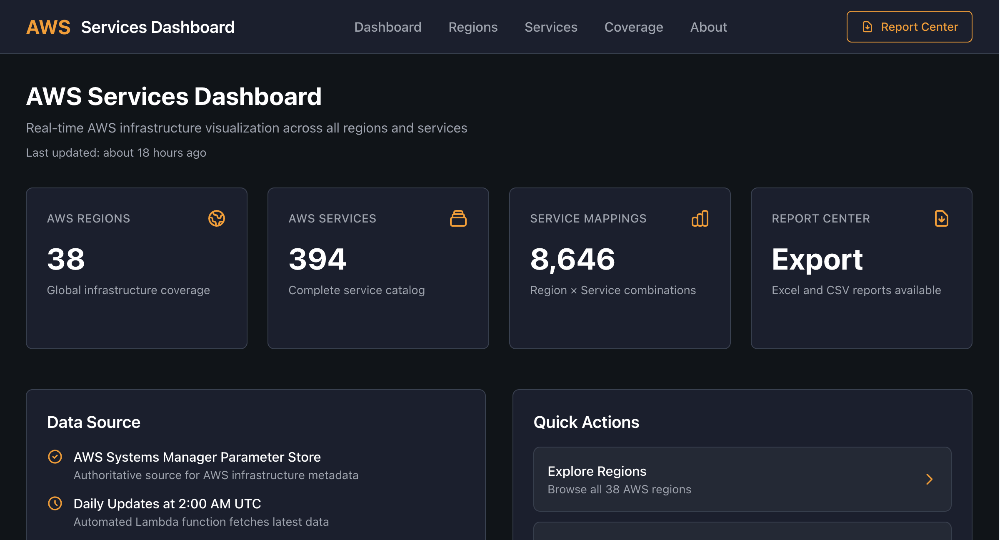

# AWS Services Dashboard Project

<div align="center">


[](https://aws-services.synepho.com)
[](https://github.com/jxman/aws-services-dashboard-project)
[](./LICENSE)

**Central documentation hub for the AWS Services Dashboard ecosystem**

[Production Site](https://aws-services.synepho.com) • [Architecture](./ARCHITECTURE.md) • [Development](./DEVELOPMENT.md) • [Deployment](./DEPLOYMENT.md)

</div>

---

## Table of Contents

- [Overview](#overview)
- [Screenshots](#screenshots)
- [Architecture](#architecture)
- [Repository Ecosystem](#repository-ecosystem)
- [Key Features](#key-features)
- [Data Flow](#data-flow)
- [Technology Stack](#technology-stack)
- [Getting Started](#getting-started)
- [Project Status](#project-status)
- [Contributing](#contributing)
- [License](#license)
- [Support](#support)

---

## Overview

The AWS Services Dashboard is a real-time monitoring and reporting platform designed to provide **comprehensive visibility into AWS infrastructure across multiple accounts and regions**.

### Main Purpose

The dashboard enables users to:

- **View Current AWS Services**: Get up-to-date information on all active AWS services across your organization
- **Monitor Regional Deployments**: Track which services are deployed in which AWS regions in real-time
- **Analyze Resource Distribution**: Understand how AWS resources are distributed geographically and across accounts
- **Identify Coverage Gaps**: Quickly spot which regions or services have limited or no coverage
- **Generate Reports**: Create detailed Excel reports of your current AWS infrastructure state
- **Track Changes Over Time**: Monitor infrastructure evolution and expansion patterns

### How It Works

This multi-repository system:

1. **Collects** infrastructure data automatically via scheduled Lambda functions
2. **Processes** data from multiple AWS accounts and consolidates it
3. **Stores** current state as JSON data accessible via CloudFront CDN
4. **Presents** live data through an interactive React dashboard
5. **Reports** on-demand Excel exports for offline analysis

The system ensures users always see the **most current state** of their AWS infrastructure, updated automatically without manual intervention.

## Screenshots

<div align="center">



_Dashboard views: Overview • Regions • Services • Coverage_

</div>

## Architecture

```
┌─────────────────────────────────────────────────────────────────────┐
│                     AWS Services Dashboard Project                  │
│                    https://aws-services.synepho.com                 │
└─────────────────────────────────────────────────────────────────────┘

┌─────────────────┐    ┌─────────────────┐    ┌─────────────────┐
│  CloudWatch +   │───▶│  Data Fetcher   │───▶│   S3 Bucket     │
│  AWS Services   │    │   (Lambda)      │    │  (JSON Data)    │
│   (Multiple     │    │ aws-infra-      │    │ Distribution    │
│   Accounts)     │    │ structure-      │    │    Store        │
└─────────────────┘    │  fetcher        │    └───────┬─-───────┘
                       └─────────────────┘            │
                             │                        │
                             │                        ▼
┌─────────────────┐          │              ┌─────────────────┐
│   Reporter      │          │              │  CloudFront +   │
│   (Lambda)      │          │              │   S3 Hosting    │
│ nodejs-aws-     │          │              │                 │
│   reporter      │          │              │ synepho-s3cf-   │
│ (Excel Gen)     │          │              │      site       │
└────────┬────────┘          │              │  (Terraform)    │
         │                   │              └────────┬────────┘
         │                   │                       │
         │                   ▼                       ▼
         │         ┌─────────────────┐    ┌─────────────────┐
         │         │   CloudWatch    │    │  React Site     │
         │         │    Triggers     │    │  (Frontend)     │
         │         │ (EventBridge)   │    │ aws-services-   │
         │         └─────────────────┘    │      site       │
         │                                └────────┬────────┘
         │                                         │
         └────────────▶ Excel Reports ◀────────────┘
                       (User Download)
```

## Repository Ecosystem

This project consists of four interconnected repositories:

| Repository                                                                        | Purpose            | Technology        | Version/Status |
| --------------------------------------------------------------------------------- | ------------------ | ----------------- | -------------- |
| [aws-services-site](https://github.com/jxman/aws-services-site)                   | Frontend dashboard | React 18 + Vite 5 | v2.2.0 ✅      |
| [aws-infrastructure-fetcher](https://github.com/jxman/aws-infrastructure-fetcher) | Data collection    | Node.js 20 Lambda | 13 commits ✅  |
| [nodejs-aws-reporter](https://github.com/jxman/nodejs-aws-reporter)               | Report generation  | Node.js 20 Lambda | 17 commits ✅  |
| [synepho-s3cf-site](https://github.com/jxman/synepho-s3cf-site)                   | Infrastructure     | Terraform ≥1.7    | Multi-env ✅   |

## Key Features

- **Multi-Account Support**: Monitor AWS resources across multiple accounts
- **Real-Time Data**: Scheduled Lambda functions collect current state
- **Regional Insights**: Track resource distribution across AWS regions
- **Excel Reporting**: Generate downloadable Excel reports on-demand
- **Modern UI**: React-based dashboard with responsive design
- **Secure Hosting**: CloudFront + S3 with HTTPS
- **Infrastructure as Code**: Complete Terraform management

## Quick Links

- **Documentation**:

  - [Architecture Details](./ARCHITECTURE.md)
  - [Repository Directory](./REPOSITORIES.md)
  - [Development Guide](./DEVELOPMENT.md)
  - [Deployment Procedures](./DEPLOYMENT.md)

- **Production**:
  - Dashboard: https://aws-services.synepho.com
  - Main Site: https://synepho.com

## Data Flow

1. **Collection**: AWS Infrastructure Fetcher Lambda runs on schedule (EventBridge)
2. **Storage**: Data written to S3 bucket as JSON files
3. **Distribution**: CloudFront serves data to React frontend
4. **Presentation**: React app fetches and displays data with visualizations
5. **Reporting**: Reporter Lambda generates Excel files on user request

## Technology Stack

### Frontend

- React 18+ with Vite
- TanStack Query for data fetching
- Recharts for visualizations
- Tailwind CSS for styling
- React Router for navigation

### Backend

- AWS Lambda (Node.js)
- EventBridge for scheduling
- S3 for data storage
- CloudWatch for monitoring

### Infrastructure

- Terraform for IaC
- CloudFront for CDN
- Route53 for DNS
- ACM for SSL certificates
- GitHub Actions for CI/CD

## Getting Started

### For Development

1. Clone the repository you need to work on (see [REPOSITORIES.md](./REPOSITORIES.md))
2. Follow the setup instructions in that repository's README
3. Refer to [DEVELOPMENT.md](./DEVELOPMENT.md) for workflow guidelines

### For Deployment

See [DEPLOYMENT.md](./DEPLOYMENT.md) for complete deployment procedures.

## Project Status

- **Version**: 2.2.0 (Frontend), Multiple active repos
- **Status**: Production (All systems operational)
- **Last Updated**: January 2025
- **Maintained By**: Synepho
- **Production URL**: https://aws-services.synepho.com
- **Data Freshness**: Updated daily at 2:00 AM UTC
- **System Health**: ✅ All 4 repositories active and maintained

### Recent Updates (October 2025)

**Frontend (aws-services-site v2.2.0)**:
- ✅ Light/Dark mode toggle with localStorage persistence
- ✅ Mobile-responsive hamburger navigation
- ✅ What's New page (infrastructure changes + announcements)
- ✅ ErrorBoundary for graceful error handling
- ✅ ESLint configuration (0 errors/warnings)
- ✅ SEO improvements (Phase 1 complete)

**Backend Improvements**:
- ✅ Node.js 20 runtime upgrade (Data Fetcher and Reporter)
- ✅ 24-hour intelligent caching (reduces API calls)
- ✅ Automated Excel report generation
- ✅ 30-day historical data retention

**Infrastructure**:
- ✅ Multi-environment support (prod, dev, staging, aws-services)
- ✅ GitHub OIDC authentication (no long-lived credentials)
- ✅ Cross-region failover (us-east-1 to us-west-2)
- ✅ CloudWatch monitoring dashboards

## Contributing

This is a private project. For questions or issues, contact the project maintainer.

## License

Private - All rights reserved

## Support

For issues or questions:

1. Check the documentation in this repository
2. Review the specific repository's README
3. Contact the project maintainer
